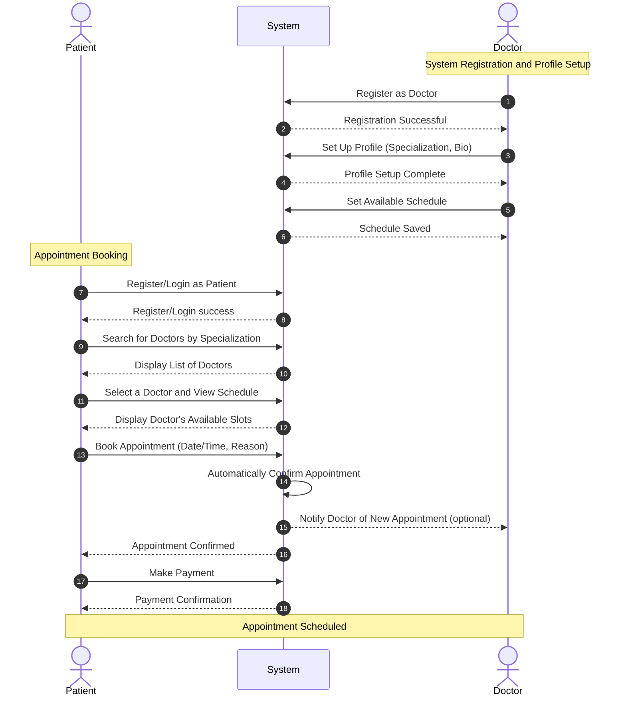

# Sequence Diagram

```mermaid
sequenceDiagram
    autonumber
    actor Patient
    participant System
    actor Doctor

    Note over Doctor:System Registration and Profile Setup

    Doctor->>System: Register as Doctor
    System-->>Doctor: Registration Successful

    Doctor->>System: Set Up Profile (Specialization, Bio)
    System-->>Doctor: Profile Setup Complete

    Doctor->>System: Set Available Schedule
    System-->>Doctor: Schedule Saved
    
    Note over Patient:Appointment Booking
    
    Patient->>System: Register/Login as Patient
    System-->>Patient: Register/Login success

    Patient->>System: Search for Doctors by Specialization
    System-->>Patient: Display List of Doctors

    Patient->>System: Select a Doctor and View Schedule
    System-->>Patient: Display Doctor's Available Slots

    Patient->>System: Book Appointment (Date/Time, Reason)
    System->>System: Automatically Confirm Appointment
    System-->>Doctor: Notify Doctor of New Appointment (optional)

    System-->>Patient: Appointment Confirmed
    Patient->>System: Make Payment
    System-->>Patient: Payment Confirmation

    Note over Patient,Doctor: Appointment Scheduled
    
```
